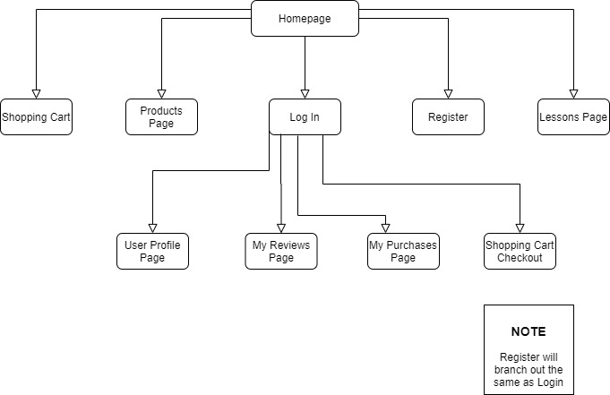
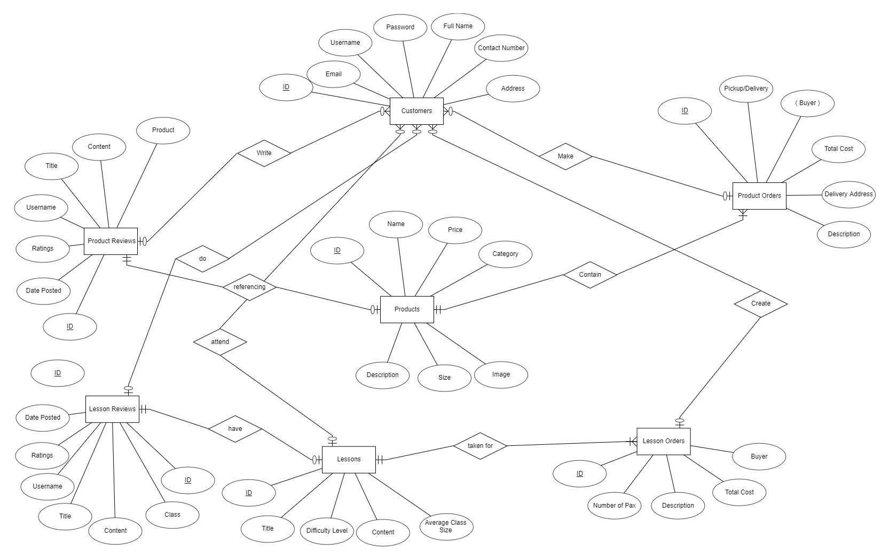
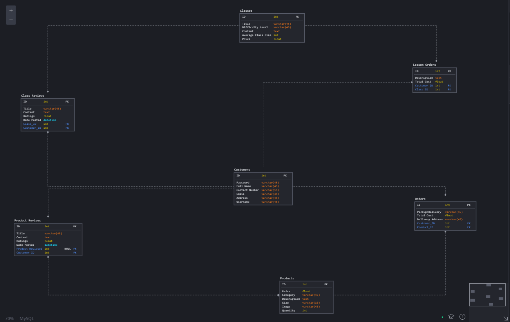

# Warm Bakes - A Home grown bakery in the midst of a crisis
## Fourth Project : Full-Stack Development With Django
A live demo of this project can be viewed [here](https://warmbakes.herokuapp.com/). 

This project adopts a  visual-approach to appeal to all the audiences who are interested in pastry and with through the use of Django framework to help to store data to the backend and manage the multi-page application.

Staff User Account
- Username: faithlol
- Password: rotiprata123

Test Customer Account
- Username: testuser123
- Password: rotiprata123

### Disclaimer
Lessons and products  as seen on the website  are mainly used for the presentation of the demo.Therefore, the items seen on the website are not to be taken seriously and are not actually real.

## UI/UX
### Strategy
#### User Stories

##### Site Owner
In the midst of the COVID-19 outbreak, many households have tuned to alternative avenues for income with some households adopting a passion in baking and eventually deciding to turn their passion into a business. In this instance, the home baker wishes to market her products with the help of her family into the internet. Utilizing an e-commerce platform, the user hopes to be able to garner attention on her products and lessons she will sell online and be profitable.

##### External Users
Be able to purchase pastry for consumption and get it to be delivered to their doorstep. In addition, they hope to be able to learn baking from experienced bakers as well.

##### Proposed Solution:
Create an e-commerce platform for the site owner to allow for both products and lessons to be marketed and gain profits.


### Scope
#### Required Functionalities
1. **CREATE/READ/UPDATE/DELETE (CRUD) Functionality**
- Database should be created for staff members to be able to edit,add and delete lessons or products.
- Customers are able to edit their profile accordingly 
- Customers are able to post a review for a product they have purchased and are able to view other customer's reviews
- Customers are able to view their past purchases and their own reviews that they have made as well.

2. **Backend Storage**
- Data with regards to products, purchases, lessons, orders and reviews should all be stored in a database.

3. **User Interaction**
- Users would be able to check own reviews and own purchases
- Users would be able to view own profile
- Users would be able to add items to a own personalized cart and checkout
4. **Presentation and Responsiveness**
- Users should be able to view the web application through different platform devices
- Lessons and products should be displayed in a clear and neat manner throughout the webpage.

### Structure



Sequence of Navigation
1. **Homepage**
- Users will be able to choose to start browsing for products or lessons, login or register.

2. **Listings and Posts**
- All users would be able to start adding items to their cart but they will have to login to be able to checkout

3. **Reviews,Purchases and Profile**
- Users logged in will be able to view their own profile, reviews and purchases.

### Skeleton
Wireframes used for the project can be found [here](readme/project_4.pdf)
### Surface
Images used in the project were related to pastry to promote a visual appeal to the audience to entice them to purchase the baker products.

Fonts used such as Arizona are used to give the home grown feel to the website.

## Features
### Current Features
-  Account system with login authentication
-  Responsive web design for different platform devices
-  Create/Edit/Read/Delete Products
-  Create/Edit/Read/Delete Lessons
-  Create Reviews
-  Read Purchases
-  Checkout to Stripe 
-  Filter Lessons and Products


### Features Left To Implement
- Create a mean for users to upvote or downvote other users reviews
- Allow for users to edit or delete reviews
- Allow for users to enter custom delivery address instead of using their own address during registration
- Allow for pagination for user reviews and purchases
- Enable discount codes for checkout page

## Technologies Used
- HTML 
- CSS
- Javascript
- JQuery
- Font Awesome
- Jinja2
- Python-dotenv
- SQLite3
- Google Fonts
- Bootstrap 
- django-phonenumber_field
- django-crispy-forms
- dj-database-url
- psycopg2
- stripe
- Visual Studio Code
- Heroku
- Github
- Git
- gunicorn
- Cloudinary
- Pillow
- Whitenoise

### Django
The web framework used in the development of the webpage that is reponsible for the key essential features such as routing, validation of forms and implementing key functions of the webpage. 

### Django-allauth
Used to provide basic security and privacy features and to enable an account login system.

### Visual Design
1. Google Fonts
- To enhance the overall display of the webpage
2. Cloudinary
- To allow users to upload images for their listings
3. Bootstrap 
- Used to layout and design the page with custom bootstrap settings in place
4. Django-crispy-forms
- Used to implement bootstrap elements into all the forms

### Security
1. python-dotenv
- Prevents senstive information from being uploaded to github
2. Stripe
- Used as the method for user to checkout their items from the cart


### Backend Tools
1. SQLite3
- Usage of Django provided back-end database for development
2. dj_database_url
- Used for establishment of heroku database


## Programming Methodology
### Context processors
Usage of context processors to allow for the cart to appear throughout the page for users to be able to track their cart at all times

### Usage of django custom filters
Usage of custom filters to allow for customized functions to be loaded and used within templates.

### Security Control
- Through the use of .env file, important and sensitive data such as secret keys are carefully hidden away so that they are not leaked into the publc.

### Source Control
- Github is used to track and manage any changes in the development of the project

## Database Design
### ER Diagram


### Logical Schema



## Testing
Testing was carried out both manually and with automation and the results of the testing are shown below:

Automated Testing 

Manual Testing


### Responsiveness
Using the inspector function of Google Chrome, the following devices was used in the testing phase for mobile responsiveness:
- Moto G4
- Galaxy S5
- Pixel 2
- Pixel 2 XL
- iPhone 5/SE
- iPhone 6/7/8
- iPhone 6/7/8 Plus
- iPhone X
- IPad
- Ipad Pro

In the testing of responsiveness to both phone and tablet devices, the webpage application is able to display and layout the correct intended design for the different
pages when tested through these different platforms.

### Bugs
- Downvote button of posts will cause the page to reload 
- If users upload many images into the create listing or edit listing form, only the latest image will be taken into the database.

## Deployment
This website is deployed on [Heroku](https://www.heroku.com). 

To deploy on Heroku
1. Download or Clone the master branch from [github](https://github.com/l0nelyhermit/Timeless)
2. To list all the requirements in requirements.txt, run the following command in terminal:
```
pip3 freeze --local > requirements.txt
```
3. Set Debug to False
4. Procfile need to be created to run gunicorn upon deployment
5. Git push to Heroku Master after all the documents are properly set up
6. Use Your Own MongoDB account to host the database and use your own cloudinary account to host the images uploaded by users
6. All public keys and private keys for the following need to be added to in Heroku Config Vars settings:
    - MongoDB URI : Your Own MONGO_URI
    - Secret Key: Choose Your Own Secret Key
    - Upload Preset: Your Own Upload Preset
    - Cloud Name: Your Own Cloud Name 

## Credits and Acknowledgement
- Bootstrap Snippets : https://bootstrapious.com/snippets
- Background Image For Homepage and Marketplace: https://wallpapercave.com/louis-moinet-watches-wallpapers
- Hero Image For Welcome Users: https://www.pexels.com/photo/close-up-photo-of-wristwatch-2113994/
- Image Used for Login Page: https://www.pexels.com/photo/men-s-white-button-up-dress-shirt-708440/
- Background Image Used for the rest of the webpage: https://www.pexels.com/photo/round-michael-kors-chronograph-watch-2783873/
- Favicon Image: https://favicon.io/emoji-favicons/watch/
- Listing Watch Images: https://stockx.com


